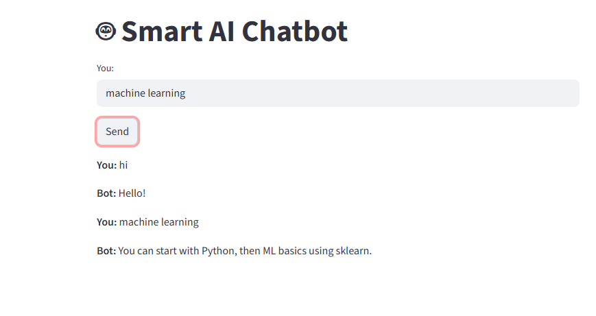

# 🤖 Smart AI Chatbot

🚀 A simple AI chatbot built using **TF-IDF Vectorization** and **Cosine Similarity**, with an interactive UI using **Streamlit**.

## 📸 Demo

🔗 Live Demo: https://smart-ai-chatbot-fzdemxhahmm9fun7sykzcr.streamlit.app/

## 🛠️ Tech Stack

- Python  
- Streamlit  
- Scikit-learn  
- NLP (TF-IDF + Cosine Similarity)

## ⚙️ Features

- Understands user input using NLP techniques  
- Matches input with predefined intents  
- Returns the most relevant response  
- Interactive web interface using Streamlit  
- Simple and lightweight chatbot system  

## 🧠 How It Works

1. User input is converted into vectors using **TF-IDF**
2. Cosine similarity is calculated with training data
3. The best matching intent is selected
4. A response is returned from the matched intent

## 📁 Project Structure

smart-ai-chatbot/ │── app.py │── chatbot.py │── intents.json │── requirements.txt │── README.md │── images/ │    └── demo.png

## 🚀 Run Locally

### 1. Clone the repository

git clone https://github.com/neham21062005/smart-ai-chatbot.git⁠ cd smart-ai-chatbot

### 2. Install dependencies

pip install -r requirements.txt

### 3. Run the app

streamlit run app.py

## 📌 Example Inputs

Try these inputs:
- hello  
- hi  
- good morning  
- bye  
- thanks  

## 🚀 Future Improvements

- Add more intents for better responses  
- Improve NLP using advanced models  
- Add chatbot memory  
- Enhance UI design  

## 🙌 Author

Your Name  
🔗 LinkedIn: https://www.linkedin.com/in/neha-m-022854350?utm_source=share_via&utm_content=profile&utm_medium=member_android
🔗 GitHub: https://github.com/neham21062005

## ⭐ Support

If you like this project, give it a ⭐ on GitHub!
